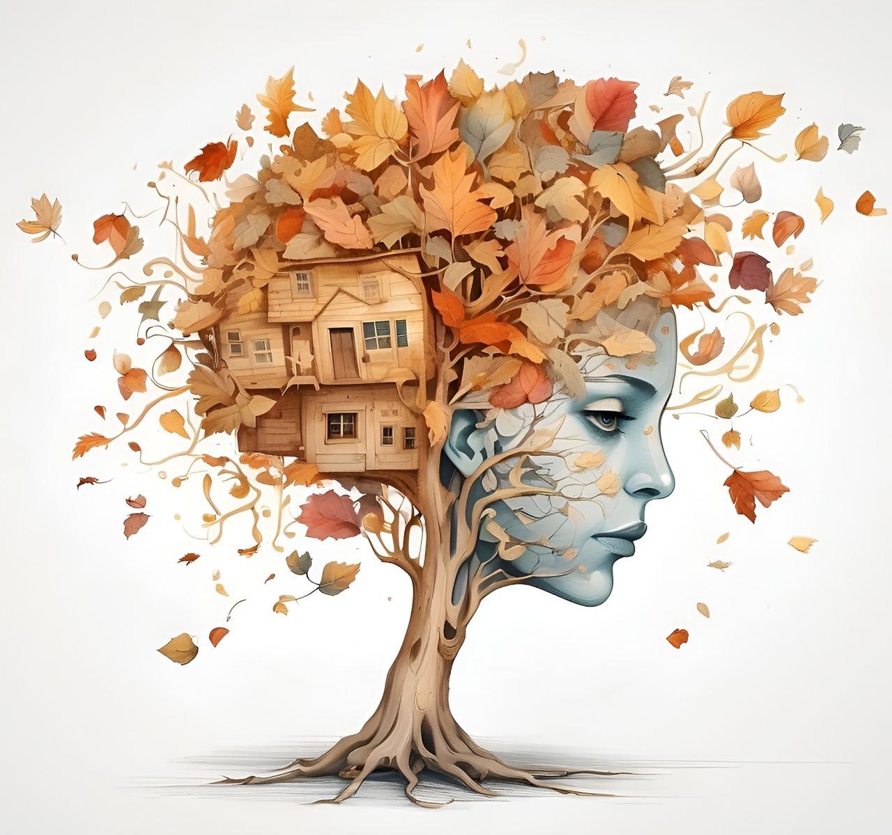
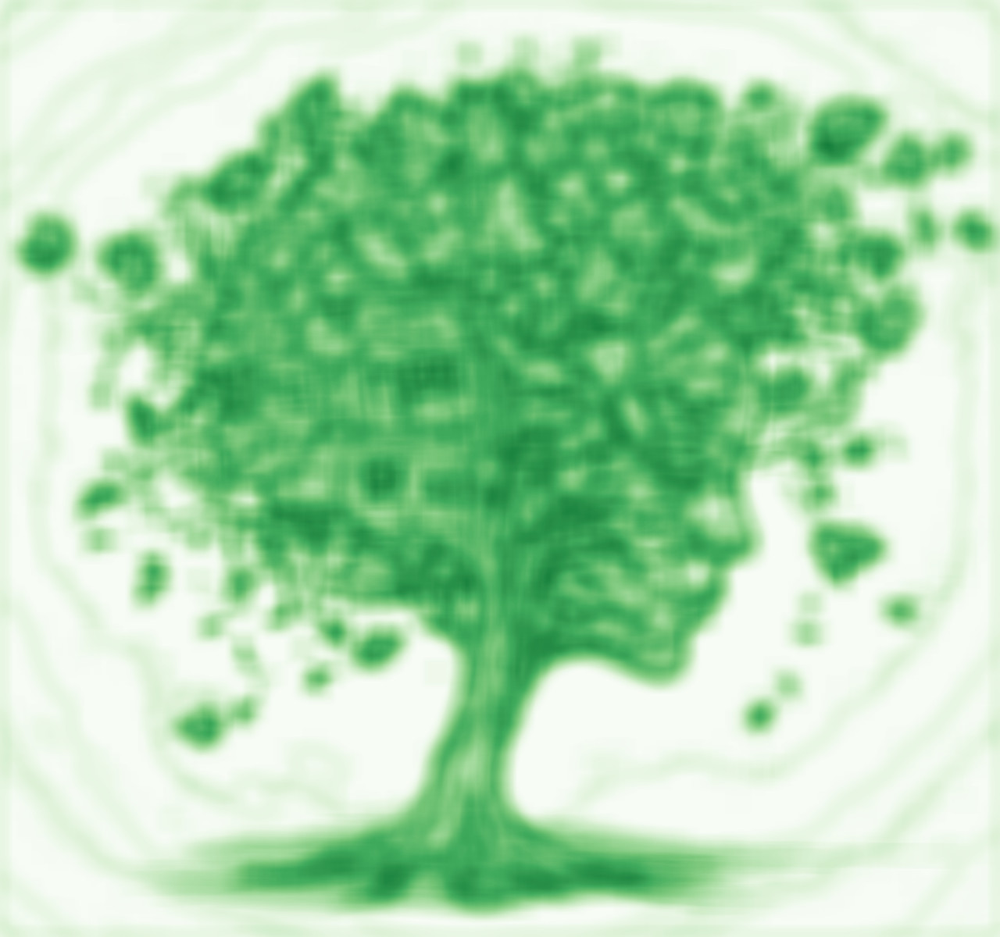

# ShannonEntropy
Calculate normalized Shannon entropy of grayscale or RGB images.

## Usage

` ./ShannonEntropy [options] <image1> <image2>` ...

## Options

 `-p` padding : single-sided padding of pixel window (default: 4)

 `-o` directory : output directory (defaults to parent directory of input file)

 `-v` : verbose mode (prints additional information)

 `-h` : display this help and exit

## Example

` ./ShannonEntropy -p 4 -o output_dir image1.png image2.jpg`

This will calculate the normalized Shannon entropy for each input image with a padding of 4 pixels and save the results in `output_dir`.  The output files will be named `image1_entropy_9x9.txt` and `image2_entropy_9x9.txt`, where '9x9' corresponds to the window size of 1+2×padding (in this case, 1+2×4 = 9).

## Notes

The input images should be in a format supported by `stb_image.h`, such as PNG or JPEG.  For grayscale images, the pixel values are directly interpreted as intensity values. For RGB images, a 15-bit grayscale value is calculated by stacking each channel's most-significant 5 bits.

 The output files will contain the normalized Shannon entropy values for each pixel, where 0 corresponds to uniform distribution and 1 corresponds to maximum entropy. The output format is a space-separated text file with one line per row of pixels.

## Installation

To compile the source code, a C++ compiler, e.g. `g++`, is required.

* Define your compiler with the environment variable `CXX`, otherwise `g++` is assumed.
* `make all` in the source directory.

The executable is called `ShannonEntropy`.

## Gallery

| padding | Image |
|:-------:|:-----:|
| source |  |
| 4 → 9×9 |  |
| 8 → 17×17 |  |
| 16 → 33×33 |  |

